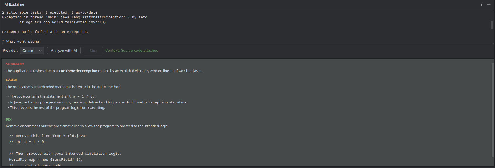

# AI Explainer

[//]: # ([![Version]&#40;https://img.shields.io/jetbrains/plugin/v/MARKETPLACE_ID.svg&#41;]&#40;https://plugins.jetbrains.com/plugin/MARKETPLACE_ID&#41;)

[//]: # ([![Downloads]&#40;https://img.shields.io/jetbrains/plugin/d/MARKETPLACE_ID.svg&#41;]&#40;https://plugins.jetbrains.com/plugin/MARKETPLACE_ID&#41;)

A tool for IntelliJ IDEA that helps with debugging by pulling in code context for error analysis. Instead of just looking at an error string, it finds the relevant Java file in your project and includes the code when asking an AI for help.

## How it works

The plugin identified a common problem: error messages often lack context. This plugin automates the manual work:
*   **Context Injection:** It finds the `.java` file name inside a stack trace or error message using regex.
*   **Source Retrieval:** It reads the actual code from your project files.
*   **Secure Keys:** It stores your API keys in the native OS keychain (via IntelliJ's `PasswordSafe`) so they aren't saved in plain text.
*   **Markdown UI:** The results are displayed in a tool window formatted for easy reading.

## Requirements

*   **IDE:** IntelliJ IDEA 2024.2 or newer.
*   **Language:** Designed for Java projects.
*   **Java Version:** Project uses Java 21.

## Usage

1.  **Set up your key:** Go to `Settings` > `Tools` > `AI Explainer`. Choose OpenAI or Gemini and paste your key.
2.  **Analyze:** Highlight an error in your terminal or run console.
3.  **Run:** Right-click and choose **AI Explainer: Analyze Error**.
4.  **View:** The "AI Explainer" tool window at the bottom will open with the explanation.

## Installation

[//]: # (- Using the IDE built-in plugin system:)

[//]: # ()
[//]: # (  <kbd>Settings/Preferences</kbd> > <kbd>Plugins</kbd> > <kbd>Marketplace</kbd> > <kbd>Search for "plugin"</kbd> >)

[//]: # (  <kbd>Install</kbd>)

[//]: # ()
[//]: # (- Using JetBrains Marketplace:)

[//]: # ()
[//]: # (  Go to [JetBrains Marketplace]&#40;https://plugins.jetbrains.com/plugin/MARKETPLACE_ID&#41; and install it by clicking the <kbd>Install to ...</kbd> button in case your IDE is running.)

[//]: # ()
[//]: # (  You can also download the [latest release]&#40;https://plugins.jetbrains.com/plugin/MARKETPLACE_ID/versions&#41; from JetBrains Marketplace and install it manually using)

[//]: # (  <kbd>Settings/Preferences</kbd> > <kbd>Plugins</kbd> > <kbd>⚙️</kbd> > <kbd>Install plugin from disk...</kbd>)

- Manually:

  Download the [latest release](https://github.com/juliarzymowska/ai-explainer-plugin/releases/latest) and install it 
  manually using
  <kbd>Settings/Preferences</kbd> > <kbd>Plugins</kbd> > <kbd>⚙️</kbd> > <kbd>Install plugin from disk...</kbd>

---
Plugin based on the [IntelliJ Platform Plugin Template][template].

[template]: https://github.com/JetBrains/intellij-platform-plugin-template
[docs:plugin-description]: https://plugins.jetbrains.com/docs/intellij/plugin-user-experience.html#plugin-description-and-presentation
